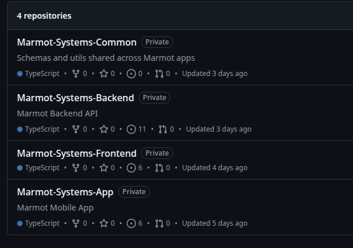

---

These are non-dogmatic best practices I follow when building out software in the startup space. Obviously you shouldn't follow these religiously, but these pratices generally work well for me and my team. If you nitpick trivialities than you should probably skip this site in its entirety. Now, if I did make a mistake, completely make something up, or if you have better solutions, please correct me and message me on twitter [@jaredsystems](https://x.com/jaredsystems).


Some context before I start since I’ll be referencing my startup marmot systems often. Marmot is a direct store delivery software (dsd). Dsd is just a distribution model where suppliers distribute products to retail. The software consists of a driver mobile app and an admin web portal. Driver features must work offline while the admin web portal is obviously dependent on the cloud.

# Who is this article for

**Bootstrapped founders**: You are bootstrapping a (preferably) B2B saas as a solo founder or with a small team.

**Junior developers**: You want to jump the awkward bridge that stands between junior and senior engineer. Being a mid level developer is a weird place to be in especially in this senior only market.

# Stack

Keep it stupid simple, especially if you are in the MVP phase of your product. This is what I went with for marmot.

**Frontend**

- Typescript + Next.js

**Backend**

- Typescript + Node.js
- Express

**Mobile App**

- Typescript + React Native

**Database**

- PostgreSQL
- Sqlite: embedded within the mobile app

**Validation**

- [Zod](https://zod.dev/)

# 1. Business Requirements

Write down your business requirements before you write a single line of code. Doing this will make everything else clearer and
simpler down the road. If you are building out an mvp for a product, than I suggest speed-running or skipping
this since your app probably won't hit product market fit. If you are close to hitting pmf or are already established than
you need to start adopting this practice.

# 2. Repos

You should probably go with a monorepo setup due to simplicity. If you want models to follow, know that most large companies go
with monorepo setups. Although, if your project does scale it could become more difficult to maintain.



I went with a polyrepo setup for decoupling reasons. It does get annoying sharing libraries and apis between repos,
but overall this structure works fine for me. There is higher mainteance with polyrepos. If I could start from scratch
I'd probably go with a monorepo setup.

[monorepo vs polyrepo devcommunity](https://dev.to/bitdev_/monorepo-vs-polyrepo-j9)

[monorepo vs polyrepo reddit](https://www.reddit.com/r/ExperiencedDevs/comments/12v3nfi/monorepo_vs_polyrepo/)

# 3. Single Source of Truth

You need one or many single source of truth.
A single source of truth (SSOT) ensures that all data elements are managed or edited in just one place within an
information system. This is to ensure data consistency and integrity. You can have many different SSOTs for different
"facts". For marmot systems, I have 2 SSOTs, one for input semantics and
another for data integrity.

- Backend acts as the SSOT for input/application semantics (password complexity, string format).
- Postgres acts as the SSOT for data integrity. (business invariants, uniqueness, foreign keys).

Example: Marmot has many moving parts: a frontend, a mobile app, and an embedded database in the mobile app.
Let's say my sqlite database on the mobile app contains duplicate user ids which must be unique and weird input with
ascii tabs/new lines. My backend and postgres database do not allow this type of data since its unnormalized or corrupt.
Thankfully, because I have SSOTs setup on my backend and on postgres, when I sync the mobile app
to my backend/database, it will fail.

To implement SSOT's you need strong validators in place.

[single source of truth wiki](https://en.wikipedia.org/wiki/Single_source_of_truth)

[What is a SSOT?](https://maddevs.io/glossary/single-source-of-truth/)

# 4. Validation

Once you have established an SSOT, you must implement it with strong validation rules while having a flexible UX.
For my backend, I do this with [Zod](https://zod.dev/).

### Backend SSOT: Zod

_Backend acts as the SSOT for input/application semantics (password complexity, string format)._

Below is how I validate this with zod for a User.

```js

/**
 * - Collapses any run of whitespace in a string (spaces, tabs, newlines, nbspb, and other weird unicode spaces etc.)
 *  into a single ASCII space.
 * - Trims leading and trailing whitespace.
 * " Jared   \n Speak  \t   Driver\t " -> "Jared Speak Driver"
 *
 * @param s
 * @returns
 */
export const normalizeSpaces = (s: string) => whitespace(s, "normalize");

/**
 * Removes all whitespace from a string
 * @param s
 * @returns
 */
export const removeAllWhitespace = (s: string) => whitespace(s, "remove");

const whitespace = (s: string, mode: GlobalTypes.WhitespaceMode) => {
  if (mode === "remove") {
    return s.replace(/\s+/g, "");
  }

  return s.replace(/\s+/g, " ").trim();
};


  User: z.strictObject({
    user_first_name: z
      .string()
      .transform(GlobalUtils.normalizeSpaces)
      .pipe(
        z
          .string()
          .min(1, "First name is required")
          .max(50, "First name must be at most 50 characters.")
      ),
    user_last_name: z
      .string()
      .transform(GlobalUtils.normalizeSpaces)
      .pipe(
        z
          .string()
          .min(1, "Last name is required")
          .max(50, "Last name must be at most 50 characters.")
      ),
    user_email: z
      .string()
      .transform(GlobalUtils.removeAllWhitespace)
      .transform((email) => email.toLowerCase())
      .pipe(
        z
          .email()
          .max(254, "Customer email must be at most 254 characters.")
      ),
    password: z
      .string()
      .min(8, "Password must be at least 8 characters")
      .max(25, "Password must be at most 25 characters")
      .regex(/[A-Z]/, "Password must contain at least one uppercase letter")
      .regex(/[a-z]/, "Password must contain at least one lowercase letter")
      .regex(/\d/, "Password must contain at least one number")
      .regex(
        /[@$!%*?&#^_+=-]/,
        "Password must contain at least one special character"
      )
      .regex(/^\S*$/, "Password cannot contain spaces or other whitespace."),
  }),
```

Based on the business requirements, I don't allow malformed data in my database (new lines, tabs, weird unicode spaces,
double spaces etc).

Notice how I am flexible with the transform callbacks. I normalize and sanitize input instead of rejecting it.
Don't punish the user for bad input, transform it.

I also have semantic sanity checks in my postgres database. This isn't part of my SSOT, this is mostly for precaution just in case
something wasn't caught through Zod. I recommend using check constraints to validate input on postgres.

### Postgres Semantic Sanity Checks

```sql
## postgres hard reject unnormalized / unsanitized items

users_first_name_spaces_normalized_check CHECK (first_name ~ '^\S+(?: \S+)*$');

users_last_name_spaces_normalized_check CHECK (last_name ~ '^\S+(?: \S+)*$');

users_email_lower_case CHECK (email = lower(email));

users_email_basic_format_check CHECK (email ~ '^[^[:space:]@]+@[^[:space:]@]+\.[^[:space:]@]+$');

```

Notice the first 2 constraints. They only reject unnormalized data that has tabs and new lines, but doesn't reject
weird unicode characters like no break space U+00A0 and thin space U+2009. Also the email constraint is rudimentary;
zod greatly simplifies these tasks which is why I do not use my database as a SSOT for input semantics.

I only have these constraints implemented to have a sort-of safe fallback. It doesn't check everything but its nice to have.
Take a pragmatic approach with semantic checks in your database. Only check what is important or necessary in your database.

### Postgres SSOT: Postgres

_Postgres acts as the SSOT for data integrity. (business invariants, uniqueness, foreign keys)._

Below are examples on how I implement this.

# Database

use timestamptz
start strict and loosen
for sql lite keep it simple, no constraints. complexity when removing or changing them

# Backend
